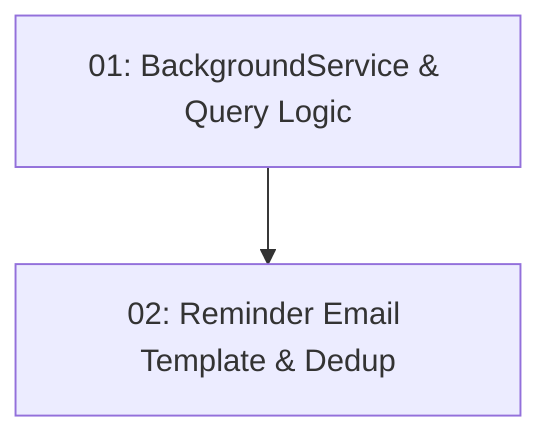

# STORY-022: 24-Hour Reminder Email

## Overview

A background service runs on schedule (every 15 minutes) and sends reminder emails to diners with confirmed reservations 24 hours away. Deduplication prevents duplicate sends.

## Quick Links

- [Requirements](./requirements.md)
- [Action Required](./action-required.md)

## Dependency Graph

## Phases

| Phase | Tasks | Description |
|-------|-------|-------------|
| 1 | task-01 | Background service with scheduling and reservation query |
| 2 | task-02 | Reminder email template and sent-tracking dedup |

## Task Status

### Phase 1
- [ ] [task-01-reminder-service](./tasks/task-01-reminder-service.md) — BackgroundService with 15-minute polling

### Phase 2
- [ ] [task-02-reminder-template](./tasks/task-02-reminder-template.md) — Reminder template and dedup tracking
