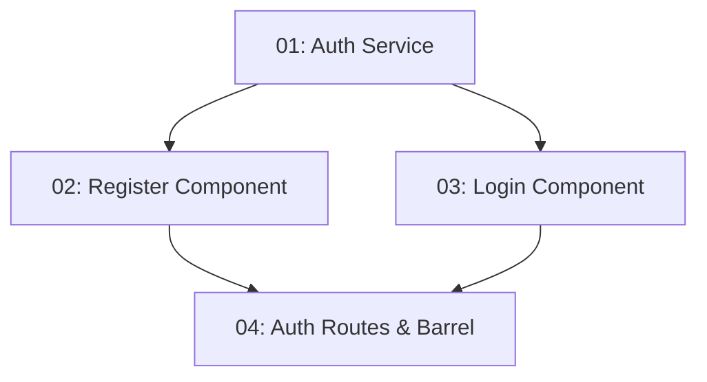

# STORY-008: Auth Feature — Frontend

## Overview

Implements the Register and Login pages in Angular. Users can create accounts and sign in from the browser. The auth service stores the JWT in localStorage and exposes an `isAuthenticated` signal. Error messages from the API are shown inline.

## Quick Links

- [Requirements](./requirements.md)
- [Action Required](./action-required.md)

## Dependency Graph

## Phases

| Phase | Tasks | Description |
|-------|-------|-------------|
| 1 | task-01 | Auth service with token storage and authentication signal |
| 2 | task-02, task-03 | Register and login form components (parallel, different files) |
| 3 | task-04 | Route configuration and barrel exports |

## Task Status

### Phase 1
- [ ] [task-01-auth-service](./tasks/task-01-auth-service.md) — Core auth service with JWT storage

### Phase 2
- [ ] [task-02-register-component](./tasks/task-02-register-component.md) — Register form component
- [ ] [task-03-login-component](./tasks/task-03-login-component.md) — Login form component

### Phase 3
- [ ] [task-04-auth-routes](./tasks/task-04-auth-routes.md) — Auth feature routes and barrel exports
