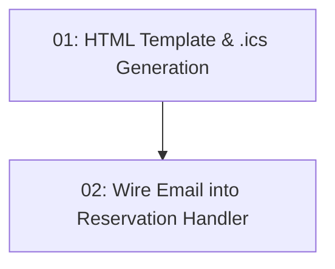

# STORY-021: Booking Confirmation Email

## Overview

Sends an HTML confirmation email with a `.ics` calendar attachment after a successful reservation. Includes a Google Maps directions link. Email failure does not fail the booking.

## Quick Links

- [Requirements](./requirements.md)
- [Action Required](./action-required.md)

## Dependency Graph

## Phases

| Phase | Tasks | Description |
|-------|-------|-------------|
| 1 | task-01 | HTML email template and .ics calendar file generator |
| 2 | task-02 | Fire-and-forget email call after successful booking |

## Task Status

### Phase 1
- [ ] [task-01-email-template](./tasks/task-01-email-template.md) — HTML template and iCalendar .ics generator

### Phase 2
- [ ] [task-02-handler-integration](./tasks/task-02-handler-integration.md) — Send email after reservation creation
