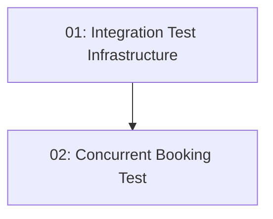

# STORY-019: Concurrency Integration Test

## Overview

Adds an integration test that fires two simultaneous booking requests for the same slot and asserts exactly one 201 and one 409. Proves double-booking prevention works end-to-end. Uses `WebApplicationFactory<Program>` with a real test database.

## Quick Links

- [Requirements](./requirements.md)
- [Action Required](./action-required.md)

## Dependency Graph

## Phases

| Phase | Tasks | Description |
|-------|-------|-------------|
| 1 | task-01 | Test infrastructure (Testcontainers, api_fixture base class) |
| 2 | task-02 | Actual concurrent booking test |

## Task Status

### Phase 1
- [ ] [task-01-test-infra](./tasks/task-01-test-infra.md) — WebApplicationFactory and Testcontainers setup

### Phase 2
- [ ] [task-02-concurrency-test](./tasks/task-02-concurrency-test.md) — Concurrent booking test with Task.WhenAll
