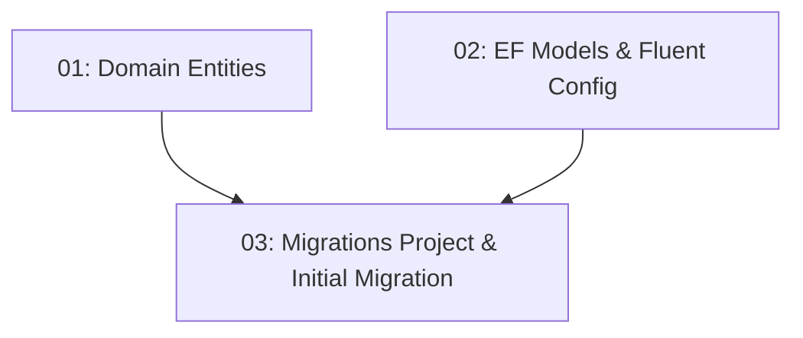

# STORY-003: Database Schema & EF Core Migrations

## Overview

Defines all domain entities and EF Core models for the four core tables: User, Restaurant, TimeSlot, and Reservation. Uses code-first Fluent API configurations and creates the initial EF migration. After this story, `dotnet ef database update` applies the full schema to SQLite (dev) or SQL Server (prod) without errors.

## Quick Links

- [Requirements](./requirements.md) — full requirements and acceptance criteria
- [Action Required](./action-required.md) — manual steps needing human action

## Dependency Graph

## Phases

| Phase | Tasks | Description |
|-------|-------|-------------|
| 1 | task-01, task-02 | Create domain entities and EF models in parallel (different files) |
| 2 | task-03 | Create Migrations project and initial migration |

## Task Status

### Phase 1
- [ ] [task-01-domain-entities](./tasks/task-01-domain-entities.md) — User, Restaurant, TimeSlot, Reservation domain entities
- [ ] [task-02-ef-models-configs](./tasks/task-02-ef-models-configs.md) — EF Core models and Fluent API configurations

### Phase 2
- [ ] [task-03-migrations](./tasks/task-03-migrations.md) — Migrations project and initial database migration
