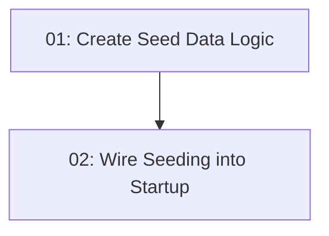

# STORY-004: Database Seed Data

## Overview

Seeds the database with realistic restaurant, time-slot, and test-user data so that the MVP is demonstrable immediately after `dotnet ef database update`. Includes 15+ restaurants across 3–5 cuisine types, 30 days of future time slots per restaurant, and 2 test user accounts.

## Quick Links

- [Requirements](./requirements.md)
- [Action Required](./action-required.md)

## Dependency Graph

## Phases

| Phase | Tasks | Description |
|-------|-------|-------------|
| 1 | task-01 | Create seed data classes for restaurants, time slots, users |
| 2 | task-02 | Register seed service and call it at startup |

## Task Status

### Phase 1
- [ ] [task-01-seed-data-class](./tasks/task-01-seed-data-class.md) — Create restaurant, slot, and user seed data

### Phase 2
- [ ] [task-02-startup-seeding](./tasks/task-02-startup-seeding.md) — Wire seed service into app startup
