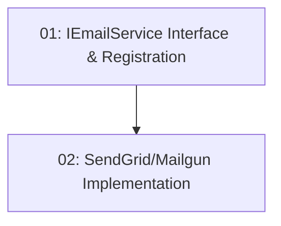

# STORY-020: Email Service Integration

## Overview

Creates an `IEmailService` abstraction backed by SendGrid or Mailgun. Retry logic on transient failures. Provider is swappable via config. This infrastructure story unlocks STORY-021 and STORY-022.

## Quick Links

- [Requirements](./requirements.md)
- [Action Required](./action-required.md)

## Dependency Graph

## Phases

| Phase | Tasks | Description |
|-------|-------|-------------|
| 1 | task-01 | Interface, abstractions, DI registration |
| 2 | task-02 | Concrete provider implementation with retry |

## Task Status

### Phase 1
- [ ] [task-01-email-interface](./tasks/task-01-email-interface.md) — IEmailService + EmailMessage models

### Phase 2
- [ ] [task-02-email-provider](./tasks/task-02-email-provider.md) — SendGrid/Mailgun implementation with retry
