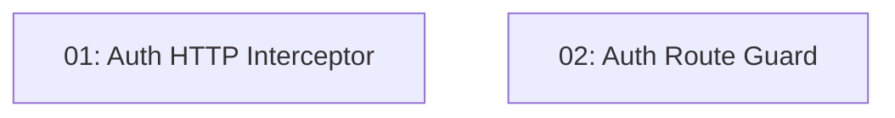

# STORY-009: JWT Interceptor & Route Guard — Frontend

## Overview

Transparently attaches the JWT to all API requests via an HTTP interceptor and redirects unauthenticated users from protected routes via a route guard. A 401 response clears the token and redirects to `/login`.

## Quick Links

- [Requirements](./requirements.md)
- [Action Required](./action-required.md)

## Dependency Graph

## Phases

| Phase | Tasks | Description |
|-------|-------|-------------|
| 1 | task-01, task-02 | Interceptor and guard are independent (different files) |

## Task Status

### Phase 1
- [ ] [task-01-auth-interceptor](./tasks/task-01-auth-interceptor.md) — JWT bearer header interceptor
- [ ] [task-02-auth-guard](./tasks/task-02-auth-guard.md) — canActivate route guard
