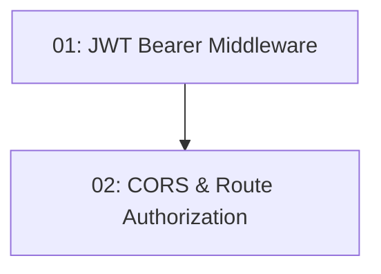

# STORY-007: JWT Middleware & Route Protection — Backend

## Overview

Configures JWT bearer authentication middleware and CORS policy so that reservation endpoints are protected. Unauthenticated requests to protected routes return 401. The Angular dev origin (`http://localhost:4200`) is explicitly allowed.

## Quick Links

- [Requirements](./requirements.md)
- [Action Required](./action-required.md)

## Dependency Graph

## Phases

| Phase | Tasks | Description |
|-------|-------|-------------|
| 1 | task-01 | AddAuthentication + AddJwtBearer in service registration |
| 2 | task-02 | CORS policy and RequireAuthorization on reservation routes |

## Task Status

### Phase 1
- [ ] [task-01-jwt-bearer](./tasks/task-01-jwt-bearer.md) — JWT bearer authentication middleware

### Phase 2
- [ ] [task-02-cors-authorization](./tasks/task-02-cors-authorization.md) — CORS policy and route protection
