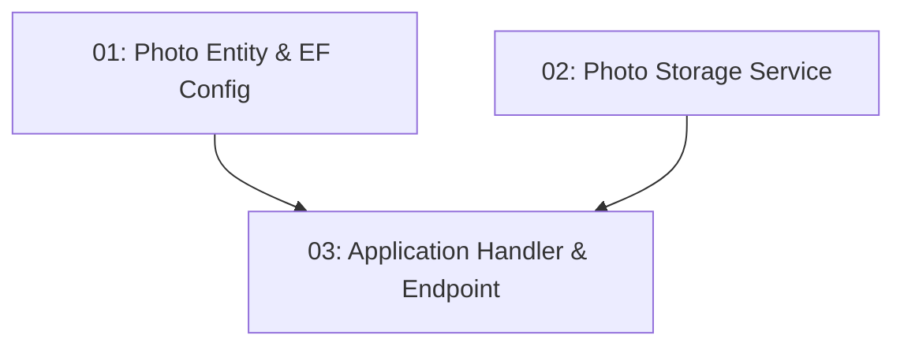

# STORY-025: Menu Photo Upload — Backend

## Overview

Restaurant operators (JWT `role = "Operator"`) can upload entree/menu photos via `POST /api/restaurants/{id}/photos`. File size ≤ 5 MB, MIME type must be JPEG/PNG/WebP. Photos appear in the restaurant detail response.

## Quick Links

- [Requirements](./requirements.md)
- [Action Required](./action-required.md)

## Dependency Graph

## Phases

| Phase | Tasks | Description |
|-------|-------|-------------|
| 1 | task-01, task-02 | Entity/migration and storage service (parallel) |
| 2 | task-03 | Application handler and endpoint |

## Task Status

### Phase 1
- [ ] [task-01-photo-entity](./tasks/task-01-photo-entity.md) — Photo entity, EF config, migration
- [ ] [task-02-photo-storage](./tasks/task-02-photo-storage.md) — IPhotoStorageService + local disk implementation

### Phase 2
- [ ] [task-03-photo-endpoint](./tasks/task-03-photo-endpoint.md) — Upload handler + endpoint with operator role check
