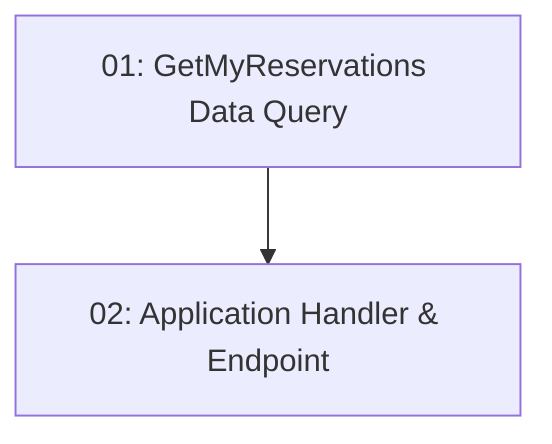

# STORY-016: My Reservations Dashboard — Backend

## Overview

Implements `GET /api/reservations/my` — returns all reservations for the authenticated user. Auth required; `userId` read from JWT claims. Returns an empty array (not 404) when the user has no reservations.

## Quick Links

- [Requirements](./requirements.md)
- [Action Required](./action-required.md)

## Dependency Graph

## Phases

| Phase | Tasks | Description |
|-------|-------|-------------|
| 1 | task-01 | Data query joining Reservation + TimeSlot + Restaurant |
| 2 | task-02 | Application handler + endpoint reading userId from JWT |

## Task Status

### Phase 1
- [ ] [task-01-my-reservations-query](./tasks/task-01-my-reservations-query.md) — GetMyReservationsQuery with cross-context join

### Phase 2
- [ ] [task-02-my-reservations-endpoint](./tasks/task-02-my-reservations-endpoint.md) — Application handler + GET /api/reservations/my
