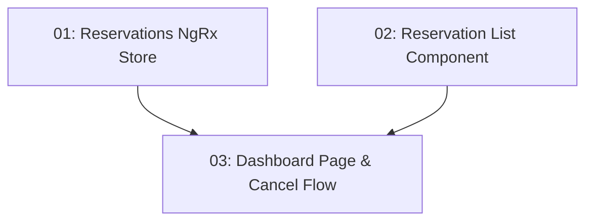

# STORY-018: My Reservations Dashboard — Frontend

## Overview

Implements the `/reservations` route showing all reservations for the authenticated user. Each row shows restaurant name, date, time, party size, and status badge. Confirmed reservations have a Cancel button with a confirmation prompt before issuing the DELETE.

## Quick Links

- [Requirements](./requirements.md)
- [Action Required](./action-required.md)

## Dependency Graph

## Phases

| Phase | Tasks | Description |
|-------|-------|-------------|
| 1 | task-01, task-02 | Store and list component (parallel, different files) |
| 2 | task-03 | Dashboard page composing both with cancel flow |

## Task Status

### Phase 1
- [ ] [task-01-reservations-store](./tasks/task-01-reservations-store.md) — NgRx Signal Store for reservations
- [ ] [task-02-reservation-list](./tasks/task-02-reservation-list.md) — Reservation list component

### Phase 2
- [ ] [task-03-dashboard-page](./tasks/task-03-dashboard-page.md) — My Reservations page with cancel flow
