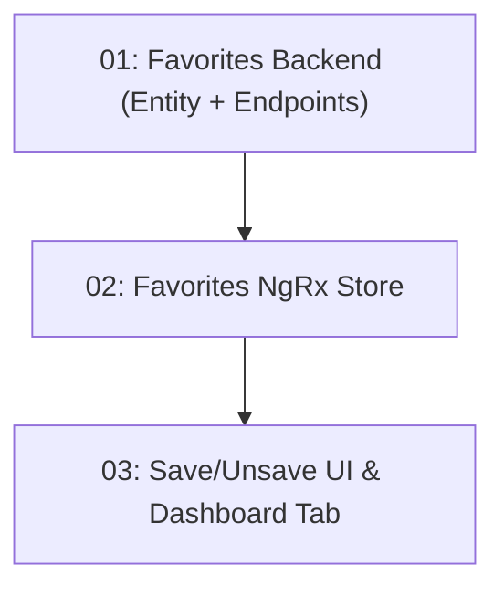

# STORY-028: Personal Bookmarks / Saved Restaurants

## Overview

Allows authenticated users to bookmark (save/unsave) restaurants. Saved state shown on cards via a heart/bookmark icon. A "My Favorites" tab in the user dashboard lists all saved restaurants.

## Quick Links

- [Requirements](./requirements.md)
- [Action Required](./action-required.md)

## Dependency Graph

## Phases

| Phase | Tasks | Description |
|-------|-------|-------------|
| 1 | task-01 | UserFavorite entity, CRUD API endpoints |
| 2 | task-02 | Frontend NgRx Signal Store for favorites state |
| 3 | task-03 | Save/unsave UI on cards and My Favorites dashboard tab |

## Task Status

### Phase 1
- [ ] [task-01-favorites-backend](./tasks/task-01-favorites-backend.md) — UserFavorite entity + POST/DELETE /api/favorites/{id}

### Phase 2
- [ ] [task-02-favorites-store](./tasks/task-02-favorites-store.md) — favorites.store.ts NgRx Signal Store

### Phase 3
- [ ] [task-03-favorites-ui](./tasks/task-03-favorites-ui.md) — Heart icon on cards + My Favorites page tab
