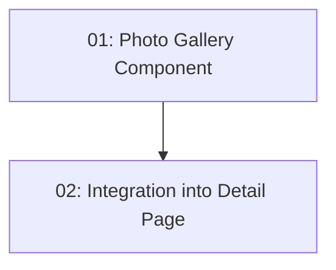

# STORY-026: Photo Gallery — Frontend

## Overview

Adds a photo gallery section to the restaurant detail page. Photos are lazy-loaded. Clicking a photo opens a lightbox (enlarged view). Skeleton placeholders shown during loading.

## Quick Links

- [Requirements](./requirements.md)
- [Action Required](./action-required.md)

## Dependency Graph

## Phases

| Phase | Tasks | Description |
|-------|-------|-------------|
| 1 | task-01 | Standalone gallery with lightbox |
| 2 | task-02 | Add gallery section to restaurant detail |

## Task Status

### Phase 1
- [ ] [task-01-gallery-component](./tasks/task-01-gallery-component.md) — Photo gallery with lightbox and lazy loading

### Phase 2
- [ ] [task-02-gallery-integration](./tasks/task-02-gallery-integration.md) — Integrate gallery into restaurant detail page
