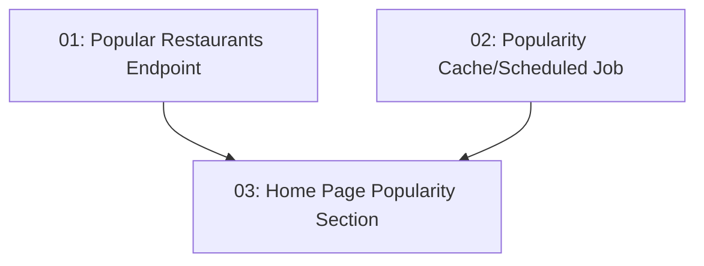

# STORY-027: Popularity Rankings & Favorites Section

## Overview

Adds a `GET /api/restaurants/popular?period=week|month&locale=` backend endpoint and a "Most Booked" section on the frontend home page. Rankings are cached or computed by a scheduled refresh job.

## Quick Links

- [Requirements](./requirements.md)
- [Action Required](./action-required.md)

## Dependency Graph

## Phases

| Phase | Tasks | Description |
|-------|-------|-------------|
| 1 | task-01, task-02 | Backend endpoint and cache job (parallel) |
| 2 | task-03 | Frontend home page section |

## Task Status

### Phase 1
- [ ] [task-01-popular-endpoint](./tasks/task-01-popular-endpoint.md) — Popular restaurants aggregation query + endpoint
- [ ] [task-02-cache-job](./tasks/task-02-cache-job.md) — Scheduled job for popularity refresh

### Phase 2
- [ ] [task-03-home-section](./tasks/task-03-home-section.md) — Home page "Most Booked" section
