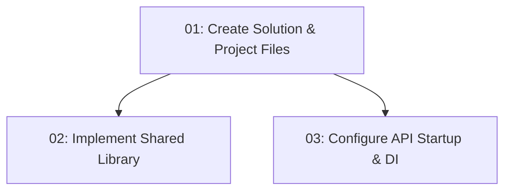

# STORY-001: Project Scaffolding — Backend

## Overview

Creates the complete .NET 10 solution structure for the TableNow backend. Establishes a modular monolith with CQRS via Mediator across three business contexts (Auth, Restaurants, Reservations). After this story, `dotnet build` passes and all subsequent backend stories have a ready-to-use, consistent project foundation.

## Quick Links

- [Requirements](./requirements.md) — full requirements and acceptance criteria
- [Action Required](./action-required.md) — manual steps needing human action

## Dependency Graph

## Phases

| Phase | Tasks | Description |
|-------|-------|-------------|
| 1 | task-01 | Create .sln, all .csproj files, folder structure, project references |
| 2 | task-02, task-03 | Implement Shared library (Result\<T\>) and API startup in parallel |

## Task Status

### Phase 1
- [ ] [task-01-solution-projects](./tasks/task-01-solution-projects.md) — Create .NET solution and all project files

### Phase 2
- [ ] [task-02-shared-library](./tasks/task-02-shared-library.md) — Implement Result\<T\> and shared types
- [ ] [task-03-api-startup](./tasks/task-03-api-startup.md) — Configure Program.cs, DI, appsettings
