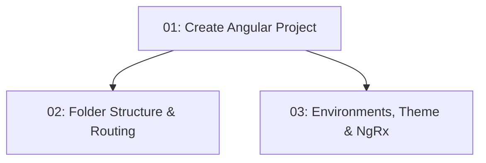

# STORY-002: Project Scaffolding — Frontend

## Overview

Creates the Angular 21 frontend project for TableNow using standalone components (no NgModules). Establishes the feature-based folder structure, Angular Material theming, NgRx Signal Store configuration, and environment files. After this story, `npm run build` succeeds and all frontend stories have a consistent foundation.

## Quick Links

- [Requirements](./requirements.md) — full requirements and acceptance criteria
- [Action Required](./action-required.md) — manual steps needing human action

## Dependency Graph

## Phases

| Phase | Tasks | Description |
|-------|-------|-------------|
| 1 | task-01 | Scaffold Angular 21 app with standalone components and Material |
| 2 | task-02, task-03 | Set up folder structure and environment config in parallel |

## Task Status

### Phase 1
- [ ] [task-01-angular-project](./tasks/task-01-angular-project.md) — Create Angular 21 standalone project

### Phase 2
- [ ] [task-02-folder-structure](./tasks/task-02-folder-structure.md) — Create core/, shared/, features/ structure
- [ ] [task-03-environment-config](./tasks/task-03-environment-config.md) — Configure environments, Material theme, NgRx
