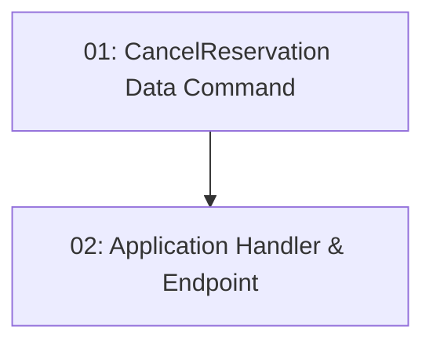

# STORY-017: Reservation Cancellation — Backend

## Overview

Implements `DELETE /api/reservations/{id}`. Sets reservation status to `Cancelled` and restores `TimeSlot.RemainingCapacity` atomically. Returns 403 if JWT user is not the reservation owner, 409 if already cancelled.

## Quick Links

- [Requirements](./requirements.md)
- [Action Required](./action-required.md)

## Dependency Graph

## Phases

| Phase | Tasks | Description |
|-------|-------|-------------|
| 1 | task-01 | Data command with atomic status update + capacity restore |
| 2 | task-02 | Application handler with owner check + endpoint |

## Task Status

### Phase 1
- [ ] [task-01-cancel-command](./tasks/task-01-cancel-command.md) — CancelReservationCommand with atomic DB updates

### Phase 2
- [ ] [task-02-cancel-endpoint](./tasks/task-02-cancel-endpoint.md) — Application handler + DELETE endpoint
