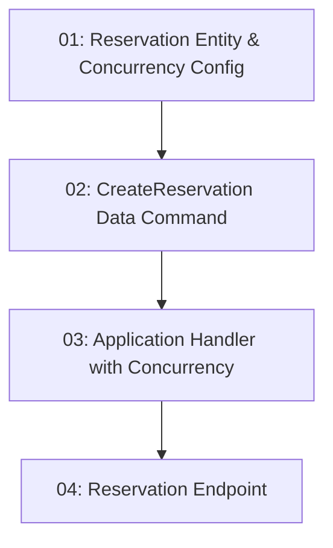

# STORY-014: Reservation Creation — Backend

## Overview

Implements `POST /api/reservations`. Uses EF Core optimistic concurrency on `TimeSlot.RowVersion` to prevent double-booking. On `DbUpdateConcurrencyException`, re-reads the slot — if still insufficient capacity, returns 409. Auth required.

## Quick Links

- [Requirements](./requirements.md)
- [Action Required](./action-required.md)

## Dependency Graph

## Phases

| Phase | Tasks | Description |
|-------|-------|-------------|
| 1 | task-01 | Domain entity and EF concurrency config |
| 2 | task-02 | Data command with atomic capacity decrement |
| 3 | task-03 | Application handler with optimistic concurrency retry |
| 4 | task-04 | Endpoint with auth requirement |

## Task Status

### Phase 1
- [ ] [task-01-reservation-entity](./tasks/task-01-reservation-entity.md) — Reservation entity & TimeSlot concurrency token

### Phase 2
- [ ] [task-02-create-command](./tasks/task-02-create-command.md) — CreateReservationCommand with capacity decrement

### Phase 3
- [ ] [task-03-app-handler](./tasks/task-03-app-handler.md) — Application handler with 409 retry logic

### Phase 4
- [ ] [task-04-endpoint](./tasks/task-04-endpoint.md) — POST /api/reservations endpoint with auth
