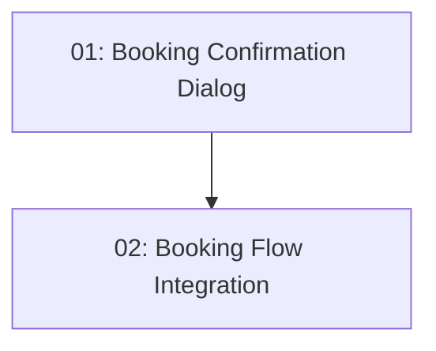

# STORY-015: Reservation Creation — Frontend

## Overview

Adds a booking confirmation step to the restaurant detail page. When a slot is selected, a confirmation dialog shows restaurant, date, time, and party size. Clicking "Confirm Booking" posts to `/api/reservations`. On 409, the slot list refreshes and an error is shown.

## Quick Links

- [Requirements](./requirements.md)
- [Action Required](./action-required.md)

## Dependency Graph

## Phases

| Phase | Tasks | Description |
|-------|-------|-------------|
| 1 | task-01 | Standalone confirmation dialog component |
| 2 | task-02 | Wire dialog into restaurant detail + handle responses |

## Task Status

### Phase 1
- [ ] [task-01-confirmation-dialog](./tasks/task-01-confirmation-dialog.md) — Angular Material dialog for booking confirmation

### Phase 2
- [ ] [task-02-booking-flow](./tasks/task-02-booking-flow.md) — Integrate booking into restaurant detail page
