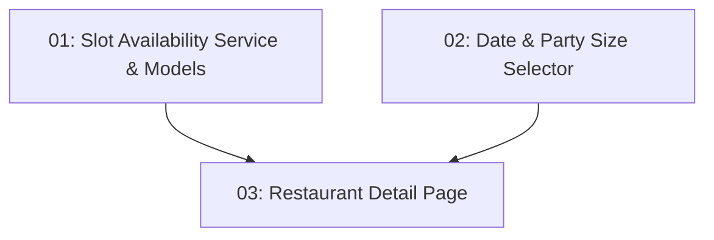

# STORY-013: Restaurant Detail & Availability — Frontend

## Overview

Implements the `/restaurants/:id` route showing full restaurant info, a date/party-size selector, and a dynamically refreshed slot list. `httpResource()` re-fetches slots when date or party size changes. Shows "No availability" message when the list is empty.

## Quick Links

- [Requirements](./requirements.md)
- [Action Required](./action-required.md)

## Dependency Graph

## Phases

| Phase | Tasks | Description |
|-------|-------|-------------|
| 1 | task-01, task-02 | Service/models and selector component (parallel) |
| 2 | task-03 | Full detail page composing both |

## Task Status

### Phase 1
- [ ] [task-01-slot-service](./tasks/task-01-slot-service.md) — Slot availability service and TypeScript models
- [ ] [task-02-availability-controls](./tasks/task-02-availability-controls.md) — Date picker and party size selector

### Phase 2
- [ ] [task-03-detail-page](./tasks/task-03-detail-page.md) — Restaurant detail page component
