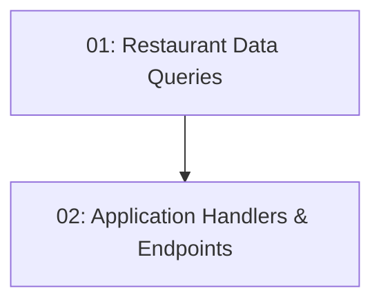

# STORY-010: Restaurant Listing — Backend

## Overview

Implements `GET /api/restaurants` (list all) and `GET /api/restaurants/{id}` (detail). Both endpoints are public (no auth required). Returns restaurant data including id, name, cuisine, address, description, and thumbnailUrl.

## Quick Links

- [Requirements](./requirements.md)
- [Action Required](./action-required.md)

## Dependency Graph

## Phases

| Phase | Tasks | Description |
|-------|-------|-------------|
| 1 | task-01 | EF data queries for listing and detail |
| 2 | task-02 | Application handlers + Minimal API endpoints |

## Task Status

### Phase 1
- [ ] [task-01-restaurant-queries](./tasks/task-01-restaurant-queries.md) — GetRestaurantsQuery + GetRestaurantByIdQuery

### Phase 2
- [ ] [task-02-restaurant-endpoints](./tasks/task-02-restaurant-endpoints.md) — Application handlers + API endpoints
