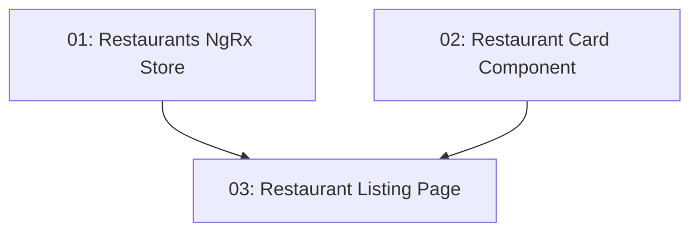

# STORY-012: Restaurant Listing — Frontend

## Overview

Implements the `/restaurants` route with a grid of restaurant cards. Includes client-side cuisine filtering via NgRx Signal Store. Clicking a card navigates to `/restaurants/:id`. Data is fetched via `httpResource()`.

## Quick Links

- [Requirements](./requirements.md)
- [Action Required](./action-required.md)

## Dependency Graph

## Phases

| Phase | Tasks | Description |
|-------|-------|-------------|
| 1 | task-01, task-02 | Store and card component (parallel, different files) |
| 2 | task-03 | Listing page composing store and card |

## Task Status

### Phase 1
- [ ] [task-01-restaurants-store](./tasks/task-01-restaurants-store.md) — NgRx Signal Store for restaurants
- [ ] [task-02-restaurant-card](./tasks/task-02-restaurant-card.md) — Restaurant card component

### Phase 2
- [ ] [task-03-listing-page](./tasks/task-03-listing-page.md) — Restaurant listing page with cuisine filter
