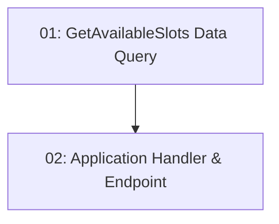

# STORY-011: Slot Availability — Backend

## Overview

Implements `GET /api/restaurants/{id}/slots?date=&partySize=` — returns only time slots with `RemainingCapacity >= partySize` for the given date. Filtering is done in EF LINQ (not in memory). Returns 400 for missing/invalid query parameters.

## Quick Links

- [Requirements](./requirements.md)
- [Action Required](./action-required.md)

## Dependency Graph

## Phases

| Phase | Tasks | Description |
|-------|-------|-------------|
| 1 | task-01 | EF data query with capacity filter |
| 2 | task-02 | Application handler + endpoint with validation |

## Task Status

### Phase 1
- [ ] [task-01-slot-query](./tasks/task-01-slot-query.md) — GetAvailableSlotsQuery with LINQ filter

### Phase 2
- [ ] [task-02-slot-endpoint](./tasks/task-02-slot-endpoint.md) — Application handler + API endpoint
