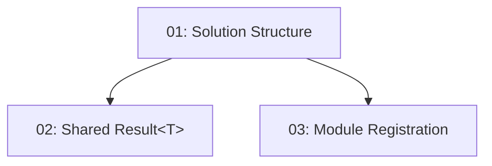

# Story 001: Project Scaffolding — Backend

## Overview

Establishes the .NET 10 modular monolith solution for TableNow. Creates all 17 project files (Api, Application × 3, Domain × 3, Data × 3, Contracts, Shared, Infrastructure × 2, Migrations, UnitTests, IntegrationTests), wires cross-project references, installs core NuGet packages, implements `Result<T>` and `TypedResultHelper`, and configures secrets-safe `appsettings.json` with module self-registration. All subsequent backend stories depend on this structure existing.

## Quick Links

- [Requirements](./requirements.md)
- [Action Required](./action-required.md)

## Dependency Graph

## Phases

| Phase | Tasks | Description |
|-------|-------|-------------|
| 1 | task-01 | Create solution file and all project skeletons with cross-project references |
| 2 | task-02, task-03 | Result&lt;T&gt; + TypedResultHelper (task-02) and module registration + config (task-03) — parallel |

## Task Status

### Phase 1
- [ ] [task-01-solution-structure](./tasks/task-01-solution-structure.md) — Create .NET 10 solution and all project files

### Phase 2
- [ ] [task-02-shared-result-type](./tasks/task-02-shared-result-type.md) — Implement Result&lt;T&gt; and TypedResultHelper
- [ ] [task-03-module-registration](./tasks/task-03-module-registration.md) — Module self-registration, appsettings, .gitignore
