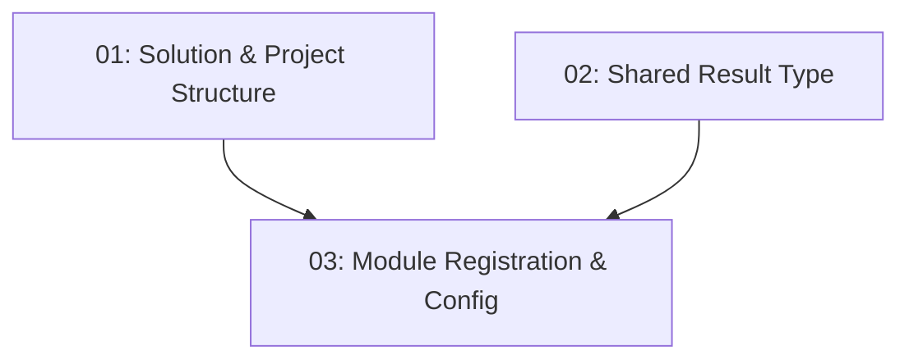

# Project Scaffolding — Backend

## Overview

This feature establishes the foundational .NET 10 modular-monolith solution for TableNow. It creates the solution file, all per-context class library projects across the Api/Application/Domain/Data/Contracts/Shared/Infrastructure/Migrations layers, the test projects, the cross-cutting `Result<T>` type, and the module-registration wiring with `appsettings.json` configuration. Every subsequent backend story (database, auth, restaurants, reservations) builds on this scaffold, so it must compile cleanly with `dotnet build` and follow the naming and folder conventions in `.docs/design/backend/`.

## Quick Links

- [Requirements](./requirements.md) — full requirements and acceptance criteria
- [Action Required](./action-required.md) — manual steps needing human action
- [Implementation Plan](./implementation-plan.md) — phased task checklist

## Dependency Graph

## Phases

| Phase | Tasks | Description |
|------|-------|-------------|
| 1 | task-01, task-02 | Create the solution, all projects, folder layout (task-01) and the `Result<T>` cross-cutting type plus `TypedResultHelper` (task-02) in parallel. |
| 2 | task-03 | Wire `ServiceCollectionExtensions.RegisterServices()` with `Add[Context]Module()` calls, add `appsettings.json` (Jwt + ConnectionStrings) and `.gitignore` secret entries. |

## Task Status

### Phase 1
- [ ] [task-01-solution-structure](./tasks/task-01-solution-structure.md) — Create the .sln and all layer/context projects
- [ ] [task-02-shared-result-type](./tasks/task-02-shared-result-type.md) — Implement `Result<T>` and `TypedResultHelper`

### Phase 2
- [ ] [task-03-module-registration](./tasks/task-03-module-registration.md) — Module registration, appsettings, and .gitignore
