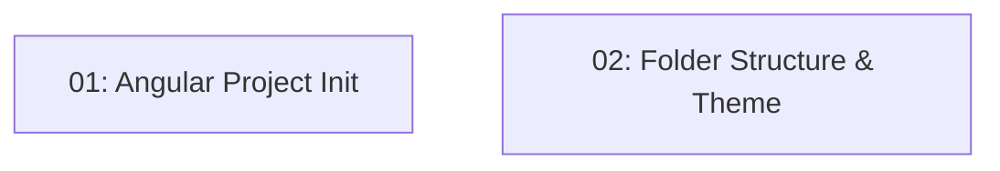

# Project Scaffolding — Frontend

## Overview

This feature scaffolds the Angular 21 frontend for TableNow as a standalone-component application (no `NgModule`, bootstrapped with `bootstrapApplication`). It initializes the project with the required toolchain — Angular Material, NgRx Signal Store, Vitest, and Playwright — and establishes the feature-based folder structure (`core/`, `shared/`, `features/`) with a custom Angular Material theme and environment configuration pointing at the backend API. Every subsequent frontend story (auth, restaurant listing, reservations) builds on this scaffold, so `npm run build` must succeed with zero errors.

## Quick Links

- [Requirements](./requirements.md) — full requirements and acceptance criteria
- [Action Required](./action-required.md) — manual steps needing human action
- [Implementation Plan](./implementation-plan.md) — phased task checklist

## Dependency Graph

## Phases

| Phase | Tasks | Description |
|------|-------|-------------|
| 1 | task-01, task-02 | Initialize the Angular 21 standalone project and add dependencies (task-01); create the `core/`/`shared/`/`features/` folder structure, custom Material theme, and environment config (task-02). Both run in parallel against disjoint files. |

## Task Status

### Phase 1
- [ ] [task-01-angular-project-init](./tasks/task-01-angular-project-init.md) — Initialize Angular 21 standalone project and add dependencies
- [ ] [task-02-folder-structure-theme](./tasks/task-02-folder-structure-theme.md) — Folder structure, Material theme, environment config
