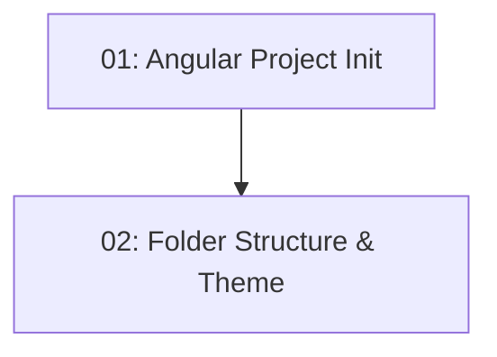

# Story 002: Project Scaffolding — Frontend

## Overview

Creates the Angular 21 standalone-component project at `./client` with the feature-based folder structure, Angular Material custom theme, NgRx Signal Store, and environment configuration. All subsequent frontend stories depend on this foundation. No application features are implemented — only the structural skeleton, routing, and design system setup.

## Quick Links

- [Requirements](./requirements.md)
- [Action Required](./action-required.md)

## Dependency Graph

## Phases

| Phase | Tasks | Description |
|-------|-------|-------------|
| 1 | task-01 | Initialize Angular 21 project with bootstrapApplication and install packages |
| 2 | task-02 | Create feature folder structure, Material theme, and environment files |

## Task Status

### Phase 1
- [ ] [task-01-angular-project-init](./tasks/task-01-angular-project-init.md) — Initialize Angular 21 with standalone bootstrapApplication

### Phase 2
- [ ] [task-02-folder-structure-theme](./tasks/task-02-folder-structure-theme.md) — Feature folders, Material theme, environment.ts
