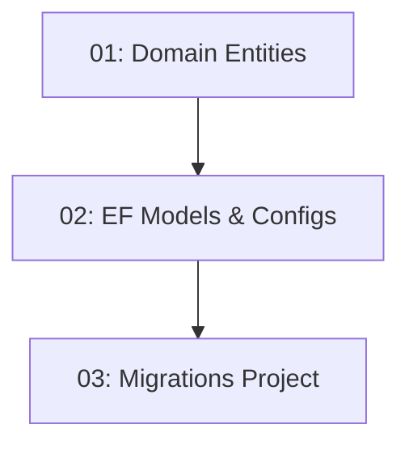

# Story 003: Database Schema & EF Core Migrations

## Overview

Creates EF Core code-first domain entities and runs the initial migration that produces the database schema. Covers four core entities — User, Restaurant, TimeSlot, and Reservation — each in their domain project (no EF attributes) with separate Fluent API configurations in the Data projects. The `TimeSlot` entity gets an optimistic concurrency token to prevent double-booking. Depends on STORY-001 (solution structure).

## Quick Links

- [Requirements](./requirements.md)
- [Action Required](./action-required.md)

## Dependency Graph

## Phases

| Phase | Tasks | Description |
|-------|-------|-------------|
| 1 | task-01 | Pure C# entity classes in Domain projects (no EF attributes) |
| 2 | task-02 | EF Core models, Fluent API configurations, AppDbContext |
| 3 | task-03 | Migrations project setup and initial migration |

## Task Status

### Phase 1
- [ ] [task-01-domain-entities](./tasks/task-01-domain-entities.md) — User, Restaurant, TimeSlot, Reservation entities

### Phase 2
- [ ] [task-02-ef-models-configs](./tasks/task-02-ef-models-configs.md) — EF configurations and AppDbContext

### Phase 3
- [ ] [task-03-migrations-project](./tasks/task-03-migrations-project.md) — Migrations project and initial migration
