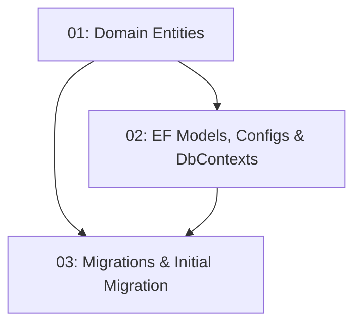

# Database Schema & EF Core Migrations

## Overview

This feature defines the core domain model for TableNow and maps it to a relational schema using EF Core code-first. It creates the `User`, `Restaurant`, `TimeSlot`, and `Reservation` domain entities (free of EF annotations), the corresponding EF models and Fluent API configurations, a `DbContext` per business context, and the migrations project that produces an initial migration applying the full schema. The `TimeSlot` entity carries a `RemainingCapacity` column and an optimistic-concurrency token so later booking logic can prevent double-booking. The schema must apply cleanly via `dotnet ef database update` against SQLite (dev) and SQL Server (prod).

## Quick Links

- [Requirements](./requirements.md) — full requirements and acceptance criteria
- [Action Required](./action-required.md) — manual steps needing human action
- [Implementation Plan](./implementation-plan.md) — phased task checklist

## Dependency Graph

## Phases

| Phase | Tasks | Description |
|------|-------|-------------|
| 1 | task-01, task-02 | Define the pure domain entities (task-01) and the EF models + Fluent API configurations + DbContexts including the TimeSlot concurrency token (task-02). |
| 2 | task-03 | Set up the migrations project, generate the initial migration covering all entities, and verify `dotnet ef database update` works against SQLite and SQL Server. |

## Task Status

### Phase 1
- [ ] [task-01-domain-entities](./tasks/task-01-domain-entities.md) — User, Restaurant, TimeSlot, Reservation domain entities
- [ ] [task-02-ef-models-configs](./tasks/task-02-ef-models-configs.md) — EF models, Fluent configs, DbContexts, concurrency token

### Phase 2
- [ ] [task-03-migrations-project](./tasks/task-03-migrations-project.md) — Migrations project and initial migration
