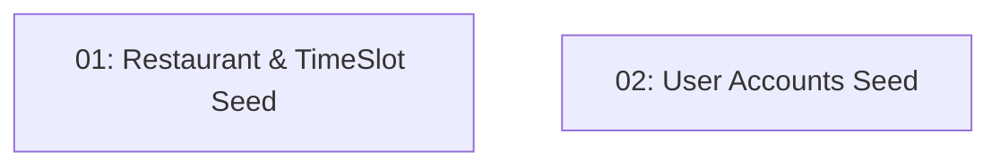

# Story 004: Database Seed Data

## Overview

Seeds the database with realistic restaurant data (15+ restaurants across 5 cuisine types), 30 days of future time slots per restaurant, and two test user accounts. This makes the MVP demonstrable without manual data entry. One slot per restaurant is seeded with `RemainingCapacity = 0` to enable testing of the "fully booked" scenario. Depends on STORY-003 (schema must exist).

## Quick Links

- [Requirements](./requirements.md)
- [Action Required](./action-required.md)

## Dependency Graph

## Phases

| Phase | Tasks | Description |
|-------|-------|-------------|
| 1 | task-01, task-02 | Seed restaurants+slots (task-01) and user accounts (task-02) — parallel, different files |

## Task Status

### Phase 1
- [ ] [task-01-restaurant-timeslot-seed](./tasks/task-01-restaurant-timeslot-seed.md) — 15+ restaurants with 30 days of time slots
- [ ] [task-02-user-accounts-seed](./tasks/task-02-user-accounts-seed.md) — Test user accounts with known credentials
