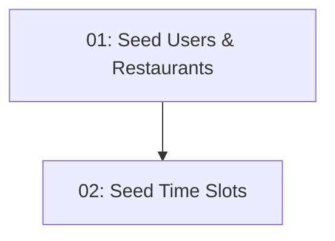

# Database Seed Data

## Overview

This feature populates the TableNow database with realistic demo data so the MVP is demonstrable immediately after `dotnet ef database update`, without any manual data entry. It seeds at least 15 restaurants across 3–5 cuisine types, 30 days of future time slots (multiple per day) for every restaurant, and at least 2 test user accounts with known credentials. A test slot with `RemainingCapacity = 0` is also seeded to verify the availability filter in STORY-011.

## Quick Links

- [Requirements](./requirements.md) — full requirements and acceptance criteria
- [Action Required](./action-required.md) — manual steps needing human action
- [Implementation Plan](./implementation-plan.md) — phased task checklist

## Dependency Graph

## Phases

| Phase | Tasks | Description |
|------|-------|-------------|
| 1 | task-01 | Seed test user accounts and restaurant records into the database. |
| 2 | task-02 | Generate 30 days of future time slots for each seeded restaurant, including a zero-capacity test slot. |

## Task Status

### Phase 1
- [x] [task-01-seed-users-restaurants](./tasks/task-01-seed-users-restaurants.md) — Test users and restaurant seed data

### Phase 2
- [x] [task-02-seed-time-slots](./tasks/task-02-seed-time-slots.md) — Time slot generation for all restaurants
