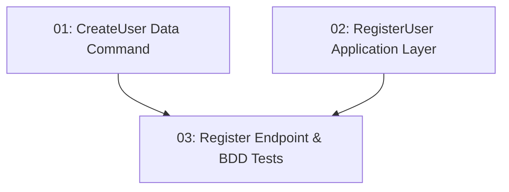

# User Registration — Backend

## Overview

This feature adds the `POST /api/auth/register` endpoint to TableNow, allowing new visitors to create an account with their name, email, and password. It follows the project's modular monolith CQRS architecture: an Application-layer `RegisterUserRequest` handler validates the request and dispatches a Data-layer `CreateUserCommand` that persists the hashed password. Duplicate email registration returns 409 Conflict. Invalid inputs return 400 with validation details. A 201 Created response with `userId`, `name`, and `email` is returned on success.

## Quick Links

- [Requirements](./requirements.md) — full requirements and acceptance criteria
- [Action Required](./action-required.md) — manual steps needing human action
- [Implementation Plan](./implementation-plan.md) — phased task checklist

## Dependency Graph

## Phases

| Phase | Tasks | Description |
|------|-------|-------------|
| 1 | task-01, task-02 | Data-layer command to persist a new user (task-01) and Application-layer handler to validate the request and orchestrate the command (task-02). These touch different layers and can run in parallel. |
| 2 | task-03 | Minimal API endpoint, Auth module mapper, and BDD unit tests covering the happy path and the duplicate-email case. |

## Task Status

### Phase 1
- [ ] [task-01-create-user-command](./tasks/task-01-create-user-command.md) — `CreateUserCommand` / `CreateUserCommandHandler`
- [ ] [task-02-register-user-application](./tasks/task-02-register-user-application.md) — `RegisterUserRequest` / `RegisterUserRequestHandler`

### Phase 2
- [ ] [task-03-register-endpoint](./tasks/task-03-register-endpoint.md) — `POST /api/auth/register` endpoint + BDD tests
