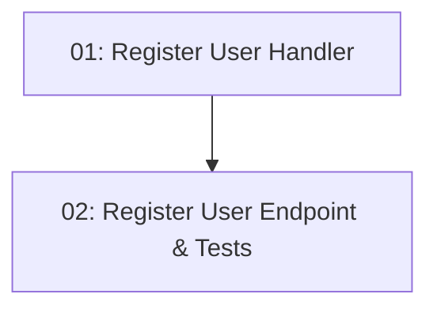

# Story 005: User Registration — Backend

## Overview

Implements the `POST /api/auth/register` endpoint so new visitors can create an account with name, email, and password. Uses BCrypt (work factor 12) for password hashing. Returns 201 on success, 409 on duplicate email, and 400 on validation failure. Follows the full CQRS stack: Application handler → Data command → EF insert. Includes BDD unit tests.

## Quick Links

- [Requirements](./requirements.md)
- [Action Required](./action-required.md)

## Dependency Graph

## Phases

| Phase | Tasks | Description |
|-------|-------|-------------|
| 1 | task-01 | Application layer + Data layer (handler, command, validator) |
| 2 | task-02 | Minimal API endpoint + BDD unit tests |

## Task Status

### Phase 1
- [ ] [task-01-register-user-handler](./tasks/task-01-register-user-handler.md) — RegisterUserRequest, handler, CreateUserCommand

### Phase 2
- [ ] [task-02-register-user-endpoint](./tasks/task-02-register-user-endpoint.md) — POST /api/auth/register + BDD tests
