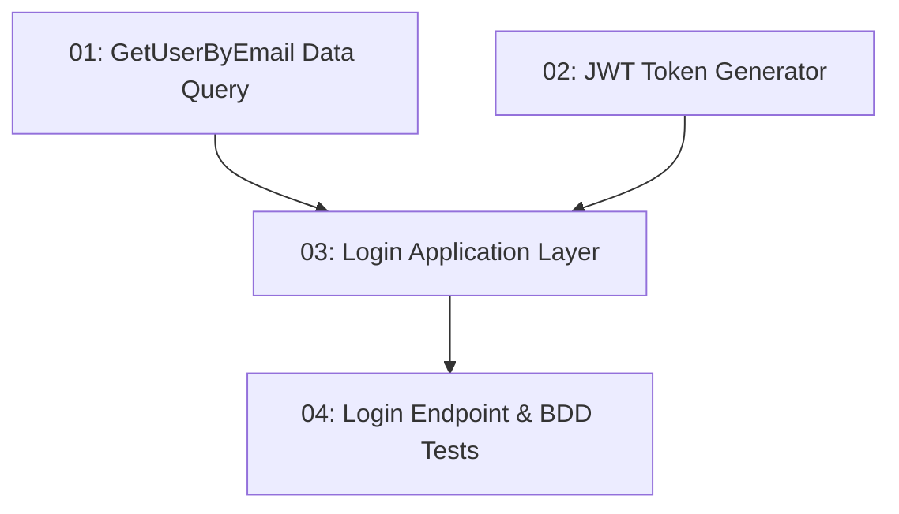

# User Sign-In — Backend

## Overview

This feature adds the `POST /api/auth/login` endpoint to TableNow, allowing returning users to authenticate with email and password and receive a JWT token. It follows the project's modular monolith CQRS architecture: a Data-layer `GetUserByEmailQuery` fetches the user record, an Infrastructure `JwtTokenGenerator` creates the signed token, and an Application-layer `LoginRequestHandler` orchestrates validation, BCrypt comparison, and token issuance. Invalid credentials return 401 without revealing which field is wrong. The JWT contains `userId`, `email`, and `role` claims and expires in 24 hours.

## Quick Links

- [Requirements](./requirements.md) — full requirements and acceptance criteria
- [Action Required](./action-required.md) — manual steps needing human action
- [Implementation Plan](./implementation-plan.md) — phased task checklist

## Dependency Graph

## Phases

| Phase | Tasks | Description |
|------|-------|-------------|
| 1 | task-01, task-02 | Data query to fetch a user by email (task-01) and JWT infrastructure helper (task-02) — different projects, fully parallel. |
| 2 | task-03 | Application-layer `LoginRequestHandler` combining user lookup, BCrypt verification, and token generation. |
| 3 | task-04 | Minimal API endpoint and BDD tests for valid credentials and invalid credentials cases. |

## Task Status

### Phase 1
- [ ] [task-01-get-user-by-email-query](./tasks/task-01-get-user-by-email-query.md) — `GetUserByEmailQuery` / `GetUserByEmailQueryHandler`
- [ ] [task-02-jwt-token-generator](./tasks/task-02-jwt-token-generator.md) — `JwtTokenGenerator` in `Infrastructure/Auth/`

### Phase 2
- [ ] [task-03-login-application](./tasks/task-03-login-application.md) — `LoginRequest` / `LoginRequestHandler`

### Phase 3
- [ ] [task-04-login-endpoint](./tasks/task-04-login-endpoint.md) — `POST /api/auth/login` endpoint + BDD tests
