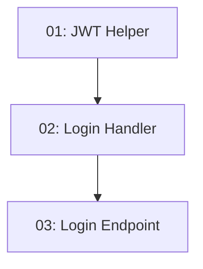

# Story 006: User Sign-In — Backend

## Overview

Implements `POST /api/auth/login` so returning users can receive a JWT. The handler verifies credentials against BCrypt hashes, generates a 24-hour JWT containing `userId`, `email`, and `role` claims, and returns `{token, expiresAt}`. The JWT secret is bound from environment config, never committed to source. Depends on STORY-005 (users must exist).

## Quick Links

- [Requirements](./requirements.md)
- [Action Required](./action-required.md)

## Dependency Graph

## Phases

| Phase | Tasks | Description |
|-------|-------|-------------|
| 1 | task-01 | JWT token generation infrastructure in Infrastructure/Auth |
| 2 | task-02 | Login request/handler using JWT helper |
| 3 | task-03 | POST /api/auth/login endpoint + BDD test |

## Task Status

### Phase 1
- [ ] [task-01-jwt-helper](./tasks/task-01-jwt-helper.md) — JwtOptions and JwtTokenGenerator

### Phase 2
- [ ] [task-02-login-handler](./tasks/task-02-login-handler.md) — LoginRequest, LoginResponse, LoginRequestHandler

### Phase 3
- [ ] [task-03-login-endpoint](./tasks/task-03-login-endpoint.md) — POST /api/auth/login endpoint + BDD test
