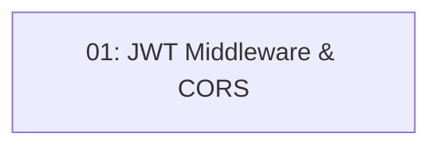

# Story 007: JWT Middleware & Route Protection — Backend

## Overview

Configures JWT Bearer authentication middleware and CORS in the Api project so that all reservation endpoints are protected and only the Angular frontend origin is allowed. Unauthenticated requests to protected routes return 401 (not a redirect). This is a single-task story since all the work lands in `Program.cs` and a helper extension.

## Quick Links

- [Requirements](./requirements.md)
- [Action Required](./action-required.md)

## Dependency Graph

## Phases

| Phase | Tasks | Description |
|-------|-------|-------------|
| 1 | task-01 | Configure JWT bearer middleware, CORS, and route protection |

## Task Status

### Phase 1
- [ ] [task-01-jwt-middleware](./tasks/task-01-jwt-middleware.md) — JWT bearer, CORS, RequireAuthorization on reservation routes
