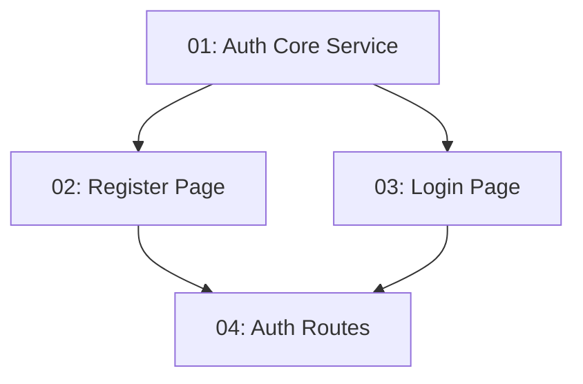

# Auth Feature — Frontend

## Overview

This feature delivers the browser-facing authentication experience for TableNow: a core `AuthService` that owns JWT storage and exposes an `isAuthenticated` signal, plus Register and Login pages built as standalone Angular components with reactive forms. On successful registration or login the JWT is persisted to `localStorage` and the user is redirected to the restaurant listing. Auth API errors (duplicate email, wrong password) surface as inline form messages.

## Quick Links

- [Requirements](./requirements.md) — full requirements and acceptance criteria
- [Action Required](./action-required.md) — manual steps needing human action

## Dependency Graph

> Note: tasks 02 and 03 both consume the `AuthService` produced in task 01 but create files in separate component folders, so they run in parallel within Phase 1. Task 01 is also in Phase 1 — coder agents in the same phase must coordinate only on shared files (none overlap here). If your orchestrator requires strict acyclic phasing, treat task 01 as the implicit prerequisite all three other tasks read its contract from this README.

## Phases

| Phase | Tasks | Description |
|------|-------|-------------|
| 1 | task-01, task-02, task-03 | Build the core auth service (token storage + `isAuthenticated` signal) and the Register and Login standalone components with reactive forms and inline error handling. The two page components touch disjoint folders and both depend only on the service contract documented here. |
| 2 | task-04 | Wire the auth feature routes (`/register`, `/login`) and the feature barrel export. |

## Task Status

### Phase 1
- [ ] [task-01-auth-core-service](./tasks/task-01-auth-core-service.md) — AuthService with JWT storage and `isAuthenticated` signal
- [ ] [task-02-register-page](./tasks/task-02-register-page.md) — RegisterComponent reactive form calling the auth API
- [ ] [task-03-login-page](./tasks/task-03-login-page.md) — LoginComponent reactive form storing the JWT

### Phase 2
- [ ] [task-04-auth-routes](./tasks/task-04-auth-routes.md) — Auth feature routes and barrel export
