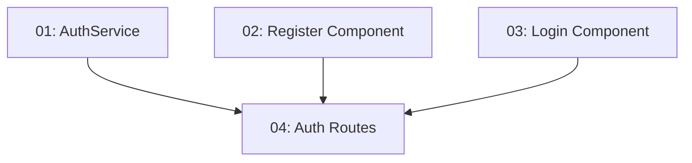

# Story 008: Auth Feature — Frontend

## Overview

Implements the Register and Login pages in the Angular frontend. A new `features/auth/` module provides reactive forms for both flows, connected to the backend auth endpoints. An `AuthService` in `core/` handles JWT storage. Depends on STORY-002 (frontend scaffold) and STORY-006 (login endpoint exists).

## Quick Links

- [Requirements](./requirements.md)
- [Action Required](./action-required.md)

## Dependency Graph

## Phases

| Phase | Tasks | Description |
|-------|-------|-------------|
| 1 | task-01, task-02, task-03 | AuthService, Register, and Login components — all parallel (different files) |
| 2 | task-04 | Route configuration wiring them together |

## Task Status

### Phase 1
- [ ] [task-01-auth-service](./tasks/task-01-auth-service.md) — AuthService with token storage and isAuthenticated signal
- [ ] [task-02-register-component](./tasks/task-02-register-component.md) — Register form component
- [ ] [task-03-login-component](./tasks/task-03-login-component.md) — Login form component

### Phase 2
- [ ] [task-04-auth-routes](./tasks/task-04-auth-routes.md) — Route configuration for /register and /login
