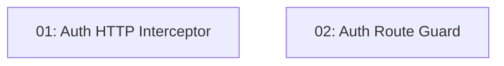

# JWT Interceptor & Route Guard — Frontend

## Overview

This feature enforces authentication transparently across the TableNow frontend. An HTTP interceptor attaches the `Authorization: Bearer <token>` header to outgoing API requests from the stored JWT and, on a `401` response, clears the token and redirects to `/login`. A functional route guard reads the `isAuthenticated` signal and redirects unauthenticated users to `/login` before they can reach protected routes. Both pieces consume the `AuthService` established in STORY-008.

## Quick Links

- [Requirements](./requirements.md) — full requirements and acceptance criteria
- [Action Required](./action-required.md) — manual steps needing human action

## Dependency Graph

> The two tasks are independent — they touch disjoint files and both only read the `AuthService` contract from STORY-008. They run fully in parallel.

## Phases

| Phase | Tasks | Description |
|------|-------|-------------|
| 1 | task-01, task-02 | Implement the functional HTTP interceptor (attach bearer header, handle 401) and the functional `canActivate` route guard (redirect unauthenticated users). Both are registered in the application's root configuration. |

## Task Status

### Phase 1
- [x] [task-01-auth-interceptor](./tasks/task-01-auth-interceptor.md) — HTTP interceptor: attach bearer header, handle 401
- [x] [task-02-auth-guard](./tasks/task-02-auth-guard.md) — Functional `canActivate` guard redirecting to `/login`
