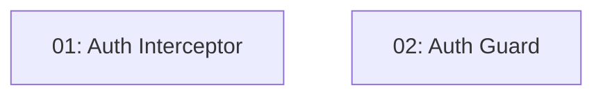

# Story 009: JWT Interceptor & Route Guard — Frontend

## Overview

Adds transparent auth enforcement to the Angular frontend. An HTTP interceptor automatically attaches the JWT to every API request and handles 401 responses by clearing the token and redirecting to login. A route guard prevents unauthenticated users from accessing protected routes. Depends on STORY-008 (AuthService must exist).

## Quick Links

- [Requirements](./requirements.md)
- [Action Required](./action-required.md)

## Dependency Graph

## Phases

| Phase | Tasks | Description |
|-------|-------|-------------|
| 1 | task-01, task-02 | Interceptor and guard are independent — parallel (different files) |

## Task Status

### Phase 1
- [ ] [task-01-auth-interceptor](./tasks/task-01-auth-interceptor.md) — HTTP interceptor attaching Bearer token
- [ ] [task-02-auth-guard](./tasks/task-02-auth-guard.md) — CanActivate guard protecting routes
