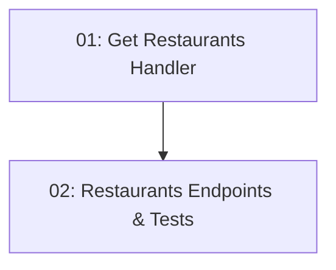

# Story 010: Restaurant Listing — Backend

## Overview

Implements `GET /api/restaurants` (list all) and `GET /api/restaurants/{id}` (single detail) endpoints. No authentication required — public endpoints. Returns restaurant data including id, name, cuisine, address, description, and thumbnailUrl. Depends on STORY-004 (seed data provides the data to return).

## Quick Links

- [Requirements](./requirements.md)
- [Action Required](./action-required.md)

## Dependency Graph

## Phases

| Phase | Tasks | Description |
|-------|-------|-------------|
| 1 | task-01 | Application + Data layer queries and handlers |
| 2 | task-02 | Minimal API endpoints and BDD unit test |

## Task Status

### Phase 1
- [ ] [task-01-get-restaurants-handler](./tasks/task-01-get-restaurants-handler.md) — GetRestaurants and GetRestaurantById queries + handlers

### Phase 2
- [ ] [task-02-restaurants-endpoints](./tasks/task-02-restaurants-endpoints.md) — REST endpoints and BDD test
