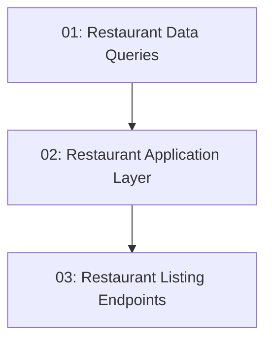

# Restaurant Listing — Backend

## Overview

This feature exposes the read-only restaurant catalog for TableNow. It adds CQRS data queries (`GetRestaurantsQuery`, `GetRestaurantByIdQuery`) that read seeded restaurants from EF Core, application-layer request handlers that translate the data results into API responses, and two public (no-auth) Minimal API endpoints: `GET /api/restaurants` (list) and `GET /api/restaurants/{id}` (detail). All handlers return `Result<T>` and the endpoints use `TypedResultHelper`.

## Quick Links

- [Requirements](./requirements.md) — full requirements and acceptance criteria
- [Action Required](./action-required.md) — manual steps needing human action

## Dependency Graph

> Tasks 01 and 02 are listed as Phase 1 parallel work per the story breakdown; they live in different layers (Data vs Application) and different projects. Task 02 consumes the data-query contract documented in this README and in task-01, so they can be built concurrently against that contract.

## Phases

| Phase | Tasks | Description |
|------|-------|-------------|
| 1 | task-01, task-02 | Implement the Data-layer CQRS queries (list + by-id) returning `Result<T>`, and the Application-layer request/handlers that map data results into API-facing responses. |
| 2 | task-03 | Add the public Minimal API endpoints (`GET /api/restaurants`, `GET /api/restaurants/{id}`) with the `RestaurantMapper` static class. |

## Task Status

### Phase 1
- [x] [task-01-restaurant-data-queries](./tasks/task-01-restaurant-data-queries.md) — `GetRestaurantsQuery` / `GetRestaurantByIdQuery` + handlers
- [x] [task-02-restaurant-application](./tasks/task-02-restaurant-application.md) — `GetRestaurantsRequest` / `GetRestaurantByIdRequest` + handlers

### Phase 2
- [x] [task-03-restaurant-listing-endpoint](./tasks/task-03-restaurant-listing-endpoint.md) — `GET /api/restaurants` and `GET /api/restaurants/{id}` endpoints + `RestaurantMapper`
