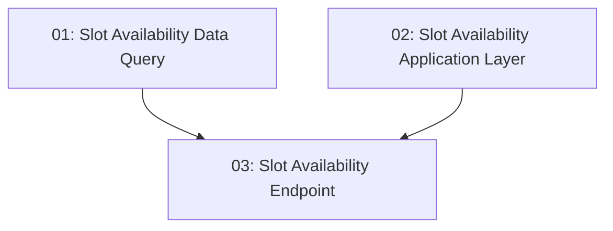

# Slot Availability — Backend

## Overview

This feature exposes the `GET /api/restaurants/{id}/slots?date=&partySize=` endpoint for TableNow. It adds a CQRS data query (`GetAvailableSlotsQuery`) that filters `TimeSlot` rows server-side in EF LINQ to only return slots where `RemainingCapacity >= partySize` for a given date, an application-layer handler that maps the data result to `TimeSlotResponse`, and a Minimal API endpoint with inline validation (400 on missing/invalid params). No authentication is required. Response must complete in < 300 ms.

## Quick Links

- [Requirements](./requirements.md) — full requirements and acceptance criteria
- [Action Required](./action-required.md) — manual steps needing human action

## Dependency Graph

> Tasks 01 and 02 are Phase 1 parallel work — they live in different layers (Data vs Application) and different projects. Task 02 consumes the `SlotData` contract defined in task-01, so they can be built concurrently against that contract.

## Phases

| Phase | Tasks | Description |
|------|-------|-------------|
| 1 | task-01, task-02 | Implement the Data-layer CQRS query filtering slots by date and party size, and the Application-layer request/handler mapping to `TimeSlotResponse`. |
| 2 | task-03 | Add the `GET /api/restaurants/{id}/slots` Minimal API endpoint with query-param validation, the `RestaurantMapper` extension, and BDD unit tests. |

## Task Status

### Phase 1
- [x] [task-01-slot-availability-data-query](./tasks/task-01-slot-availability-data-query.md) — `GetAvailableSlotsQuery` / `SlotData` / `GetAvailableSlotsQueryHandler`
- [x] [task-02-slot-availability-application-layer](./tasks/task-02-slot-availability-application-layer.md) — `GetAvailableSlotsRequest` / `GetAvailableSlotsRequestHandler`

### Phase 2
- [x] [task-03-slot-availability-endpoint](./tasks/task-03-slot-availability-endpoint.md) — `GET /api/restaurants/{id}/slots` endpoint + `RestaurantMapper` + BDD tests
