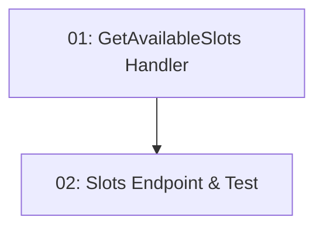

# Story 011: Slot Availability — Backend

## Overview

Implements `GET /api/restaurants/{id}/slots?date=&partySize=` returning only time slots with `RemainingCapacity >= partySize` for the given date. Filters in EF LINQ (not in memory). Returns 400 for missing/invalid parameters. Depends on STORY-004 (seed data) and STORY-010 (RestaurantsEndpoints class exists to add route to).

## Quick Links

- [Requirements](./requirements.md)
- [Action Required](./action-required.md)

## Dependency Graph

## Phases

| Phase | Tasks | Description |
|-------|-------|-------------|
| 1 | task-01 | Query + Application handler with FluentValidation |
| 2 | task-02 | Endpoint added to RestaurantsEndpoints + BDD test |

## Task Status

### Phase 1
- [ ] [task-01-get-available-slots-handler](./tasks/task-01-get-available-slots-handler.md) — GetAvailableSlotsQuery and handler

### Phase 2
- [ ] [task-02-slots-endpoint](./tasks/task-02-slots-endpoint.md) — GET /{id}/slots endpoint + BDD test
