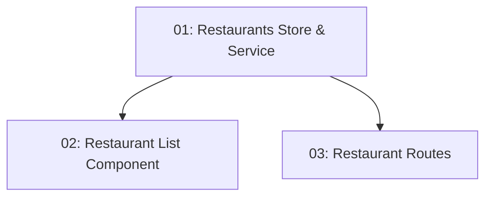

# Story 012: Restaurant Listing — Frontend

## Overview

Implements the `/restaurants` route with a grid of restaurant cards, a cuisine filter, and navigation to restaurant details. Uses NgRx Signal Store for state. Depends on STORY-009 (interceptor attaches JWT) and STORY-010 (backend endpoint exists).

## Quick Links

- [Requirements](./requirements.md)
- [Action Required](./action-required.md)

## Dependency Graph

## Phases

| Phase | Tasks | Description |
|-------|-------|-------------|
| 1 | task-01 | Signal Store + RestaurantsService |
| 2 | task-02, task-03 | List component and route config — parallel (different files) |

## Task Status

### Phase 1
- [ ] [task-01-restaurants-store-service](./tasks/task-01-restaurants-store-service.md) — NgRx Signal Store + RestaurantsService

### Phase 2
- [ ] [task-02-restaurant-list-component](./tasks/task-02-restaurant-list-component.md) — Restaurant card grid with cuisine filter
- [ ] [task-03-restaurant-routes](./tasks/task-03-restaurant-routes.md) — Route configuration
