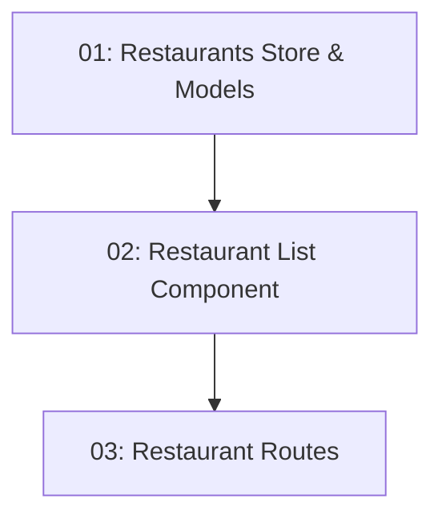

# Restaurant Listing — Frontend

## Overview

This feature adds the `/restaurants` route to the TableNow Angular client, showing a grid of restaurant cards with name, cuisine, and address. A client-side cuisine filter lets diners narrow the list without a new API call. State is managed by an NgRx Signal Store slice. Clicking a card navigates to `/restaurants/:id`. Data is fetched via `httpResource()` from the `GET /api/restaurants` endpoint added by STORY-010.

## Quick Links

- [Requirements](./requirements.md) — full requirements and acceptance criteria
- [Action Required](./action-required.md) — manual steps needing human action
- [Implementation Plan](./implementation-plan.md) — phased task checklist

## Dependency Graph

## Phases

| Phase | Tasks | Description |
|------|-------|-------------|
| 1 | task-01 | NgRx Signal Store slice, service, and TypeScript models for the restaurants feature. |
| 2 | task-02 | Restaurant list component with card grid and cuisine filter, using the store from task-01. |
| 3 | task-03 | Angular routes for the restaurants feature and integration with the app router. |

## Task Status

### Phase 1
- [ ] [task-01-restaurants-store](./tasks/task-01-restaurants-store.md) — Signal Store, service, and models

### Phase 2
- [ ] [task-02-restaurant-list-component](./tasks/task-02-restaurant-list-component.md) — Restaurant grid with cuisine filter

### Phase 3
- [ ] [task-03-restaurant-routes](./tasks/task-03-restaurant-routes.md) — Feature routes and app router wiring
