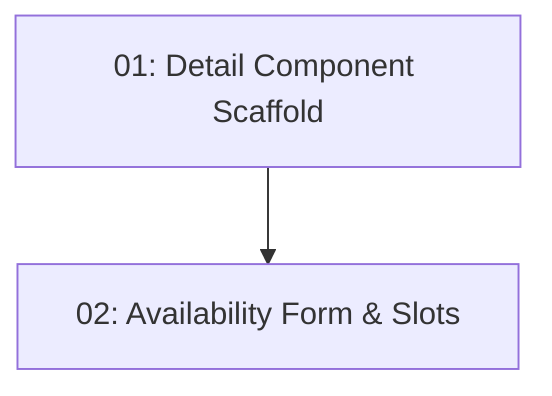

# Story 013: Restaurant Detail & Availability — Frontend

## Overview

Implements the `/restaurants/:id` detail page. Shows full restaurant info, a date picker and party size selector, and a live slot list that refreshes on form changes. Depends on STORY-012 (routing scaffold) and STORY-011 (slots endpoint).

## Quick Links

- [Requirements](./requirements.md)
- [Action Required](./action-required.md)

## Dependency Graph

## Phases

| Phase | Tasks | Description |
|-------|-------|-------------|
| 1 | task-01 | Restaurant detail component with info display |
| 2 | task-02 | Date/party-size form with live slot list |

## Task Status

### Phase 1
- [ ] [task-01-detail-component-scaffold](./tasks/task-01-detail-component-scaffold.md) — Detail page with restaurant info

### Phase 2
- [ ] [task-02-availability-form-slots](./tasks/task-02-availability-form-slots.md) — Date picker + party size + slot list
