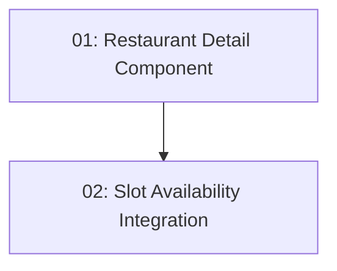

# Restaurant Detail & Availability — Frontend

## Overview

This feature adds the `/restaurants/:id` route to the Angular client, showing full restaurant details (name, description, cuisine, address) and a reactive slot availability query. A date picker (default: today + 1) and party size selector (1–20) trigger fresh queries to `GET /api/restaurants/{id}/slots?date=&partySize=`. The slot list updates in place; an empty state message is shown when no slots match. Belongs to the existing `features/restaurants/` folder.

## Quick Links

- [Requirements](./requirements.md) — full requirements and acceptance criteria
- [Action Required](./action-required.md) — manual steps needing human action
- [Implementation Plan](./implementation-plan.md) — phased task checklist

## Dependency Graph

## Phases

| Phase | Tasks | Description |
|------|-------|-------------|
| 1 | task-01 | Restaurant detail component displaying info and basic layout; route wired into restaurantRoutes. |
| 2 | task-02 | Date + party size reactive form, slot availability query via httpResource, and slot list rendering. |

## Task Status

### Phase 1
- [ ] [task-01-restaurant-detail-component](./tasks/task-01-restaurant-detail-component.md) — `/restaurants/:id` detail page

### Phase 2
- [ ] [task-02-slot-availability-integration](./tasks/task-02-slot-availability-integration.md) — Date/party-size form + slot list
