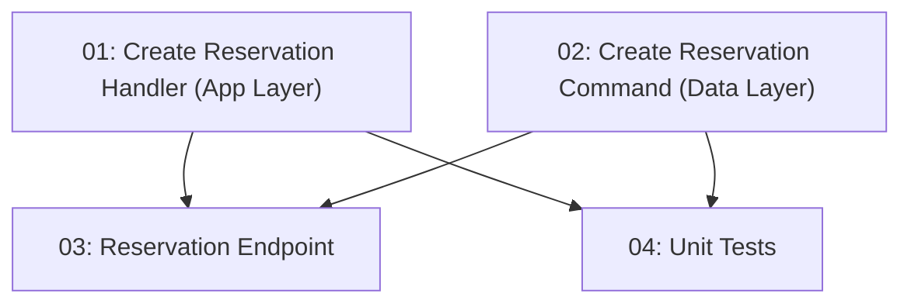

# Story 014: Reservation Creation — Backend

## Overview

Implements `POST /api/reservations` with optimistic concurrency to prevent double-booking. Two simultaneous requests for the same last-capacity slot must result in exactly one 201 and one 409. Uses EF Core `RowVersion` concurrency token and `DbUpdateConcurrencyException` handling. The most complex backend story in Phase 1.

## Quick Links

- [Requirements](./requirements.md)
- [Action Required](./action-required.md)

## Dependency Graph

## Phases

| Phase | Tasks | Description |
|-------|-------|-------------|
| 1 | task-01, task-02 | Application handler (task-01) and Data command (task-02) — parallel, different files |
| 2 | task-03, task-04 | Endpoint (task-03) and unit tests (task-04) — parallel, different files |

## Task Status

### Phase 1
- [ ] [task-01-create-reservation-handler](./tasks/task-01-create-reservation-handler.md) — Application layer request/handler
- [ ] [task-02-create-reservation-command](./tasks/task-02-create-reservation-command.md) — Data layer command with EF concurrency

### Phase 2
- [ ] [task-03-reservation-endpoint](./tasks/task-03-reservation-endpoint.md) — POST /api/reservations endpoint
- [ ] [task-04-reservation-unit-tests](./tasks/task-04-reservation-unit-tests.md) — BDD unit tests
